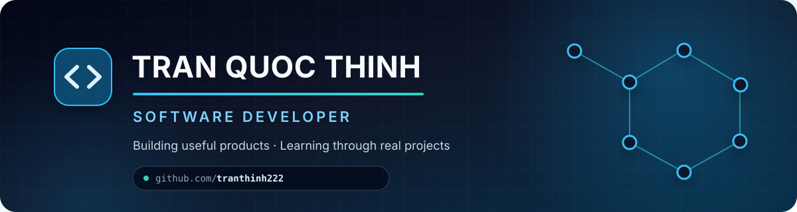

<div align="center">
  
</div>

<div align="center">
  <a href="https://github.com/tranthinh222?tab=followers"></a>
  
</div>

## Hello, I'm Thinh 👋

I'm a software developer who enjoys turning ideas into useful, maintainable products. My main playground is the Java ecosystem, and I also work across modern web frontends, databases, messaging, containers, and cloud-native tooling.

- 🔭 Building practical full-stack and microservice applications
- 🌱 Deepening my knowledge of distributed systems and DevOps
- 💡 Interested in clean architecture, event-driven systems, and developer experience
- 🤝 Open to collaborating on meaningful open-source projects
- 📍 Based in Vietnam

## Tech toolbox

<div align="center">

| Backend | Frontend | Data & Messaging | DevOps & Tools |
|:---:|:---:|:---:|:---:|
|  |  |  |  |

</div>

## What I'm working toward

```text
Design clearly  →  Build reliably  →  Ship confidently  →  Keep learning
```

I care about code that is easy to understand, systems that are observable, and products that solve a real problem. Recent projects include e-commerce microservices, booking applications, and interactive games.

## GitHub at a glance

<div align="center">
  <picture>
    <source media="(prefers-color-scheme: dark)" srcset="https://github-readme-stats.vercel.app/api?username=tranthinh222&show_icons=true&hide_border=true&rank_icon=github&theme=github_dark&bg_color=00000000" />
    <source media="(prefers-color-scheme: light)" srcset="https://github-readme-stats.vercel.app/api?username=tranthinh222&show_icons=true&hide_border=true&rank_icon=github&theme=default&bg_color=00000000" />
    
  </picture>
  <picture>
    <source media="(prefers-color-scheme: dark)" srcset="https://github-readme-stats.vercel.app/api/top-langs/?username=tranthinh222&layout=compact&hide_border=true&theme=github_dark&bg_color=00000000&langs_count=6" />
    <source media="(prefers-color-scheme: light)" srcset="https://github-readme-stats.vercel.app/api/top-langs/?username=tranthinh222&layout=compact&hide_border=true&theme=default&bg_color=00000000&langs_count=6" />
    
  </picture>
</div>

## Let's connect

<div align="center">
  <a href="https://www.linkedin.com/in/tr%E1%BA%A7n-th%E1%BB%8Bnh-a6940a3b9/"></a>
  <a href="https://github.com/tranthinh222"></a>
</div>

<br />

<div align="center">
  <sub>Thanks for stopping by. Have a look around, and feel free to connect! ✨</sub>
</div>
